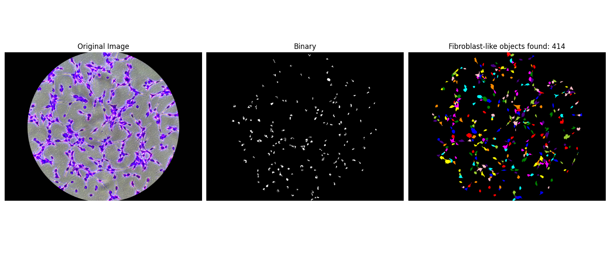
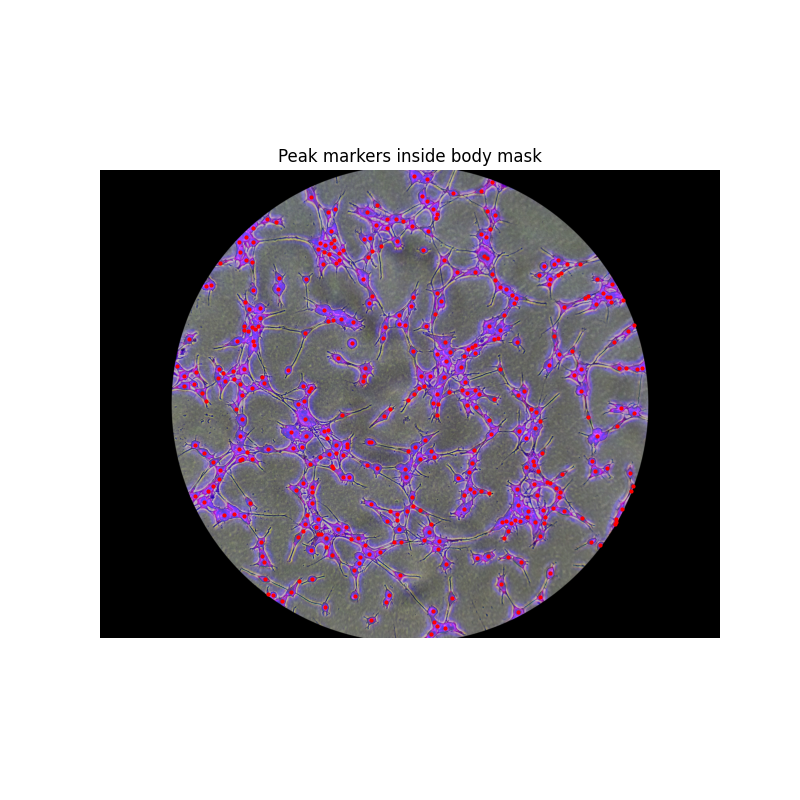
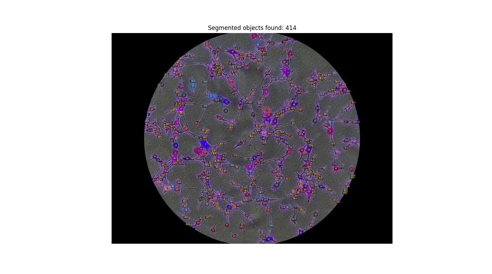

# i3T3: A Visual Reasoning Pipeline for NIH 3T3 Fibroblast Cell Identification and Quantification

*In loving memory of my mother Rochelle Isom, January 18, 1966 – February 21, 2026.*

---

**A Python-based image analysis pipeline for automated counting and morphological feature extraction of NIH-3T3 Swiss Mouse Fibroblast cells from Crystal Violet stained microscopy images.**

Developed at Santa Monica College Biotechnology Program, Spring 2026.

---

## Overview

Manual cell counting is labor-intensive and subject to observer variability. Automated tools like ImageJ require significant manual calibration and often struggle with touching or overlapping cells of irregular form. **i3T3** addresses this using a multi-stage visual reasoning approach: separate segmentation of cell bodies and nuclei, watershed-based separation of touching cells, and morphological filtering to distinguish true fibroblasts from debris and artifacts.

### Development Timeline

i3T3 was initially developed and tuned during the Santa Monica College Biotechnology Program's Bio 32 Cell Culture Methods & Techniques course. Crystal Violet stained NIH-3T3 fibroblast culture images from other experiments in the course were used. Once validated on those images, it was applied as the **dry lab / computational component** of the Cell Culture Methods & Techniques final project, which investigated the effects of Indole-3-Acetic Acid (IAA) on NIH-3T3 cell growth in vitro.

### Validation Results

When applied to the final project images and compared against both ImageJ automated counts and manual hand counts, **i3T3 significantly outperformed ImageJ**. Correlation analysis was performed in R using linear regression across 36 images spanning 4 conditions and 3 time points (24 hr, 48 hr, 72 hr):

| Method | R² vs. Manual Count |
|---|---|
| **i3T3** | **0.832** |
| ImageJ | 0.01 |

The difference in counts between methods suggests that i3T3's visual reasoning approach has the potential to be developed into a biomedical visual-reasoning model evaluation tool, filling gaps in AI evaluation and model failure analysis for image visual reasoning tasks.

---

## Sample Output

The following outputs were generated from a Crystal Violet stained NIH-3T3 culture image named `C_0051.JPG` during the development and tuning phase.

**Pipeline visualization** — original image (left), nucleus binary mask (center), and final colored segmentation (right):



**Peak local max markers** — one red dot placed inside each detected cell body prior to watershed segmentation:



**Labeled segmentation overlay** — each segmented object assigned a unique color and tracked as an independent region:



---

## Pipeline

```
Input Image (JPG/PNG)
        │
        ▼
  Grayscale Matrix
        │
        ▼
  ┌─────────────────────────────────┐
  │  Segmentation                   │
  │  ├── Cell Body Mask (Otsu)      │
  │  └── Nucleus Mask (Percentile)  │
  └─────────────────────────────────┘
        │
        ▼
  Peak Local Max Markers
  (min_distance tunable)
        │
        ▼
  Watershed Separation
        │
        ▼
  Morphological Filtering
  (fibroblast_rule: area, eccentricity,
   aspect ratio, solidity, nucleus count)
        │
        ▼
  ┌───────────────────────────────────────┐
  │  Output                               │
  │  ├── Cell count                       │
  │  ├── Labeled overlay image            │
  │  └── Per-object ML feature CSV        │
  └───────────────────────────────────────┘
```

---

## Key Features

- **Dual-mask segmentation** — cell bodies and nuclei segmented independently using Otsu thresholding and percentile-based thresholding
- **Watershed cell separation** — peak local max markers prevent over-segmentation of touching cells
- **Nucleus-aware filtering** — objects must contain 1–2 nuclei to pass the fibroblast classification rule
- **Rich feature export** — per-object CSV with 40+ morphological, intensity, skeleton, and LBP histogram features for downstream ML use
- **Tunable parameters** — `min_distance`, `sigma`, percentile threshold, and `fibroblast_rule` bounds are all exposed in-code for adaptation to different cell lines or staining conditions

---

## Features Extracted (per object)

| Category | Features |
|---|---|
| Shape | area, perimeter, eccentricity, major/minor axis, aspect ratio, solidity, extent, circularity, compactness, roundness, convexity, elongation index |
| Intensity | mean, min, max, std (from grayscale matrix) |
| Geometry | centroid (x, y), orientation, convex area, equivalent diameter, Feret diameter, bounding width/height |
| Nucleus | nucleus count, nucleus area total, nucleus area ratio, body-to-nucleus ratio |
| Skeleton | skeleton length, endpoint count |
| Texture | LBP histogram (10 bins, uniform, P=8, R=1) |
| Perimeter | extreme points: top, bottom, left, right (x, y) |

---

## Repository Structure

```
i3T3/
├── i3T3.py                    # Main pipeline script (Python)
├── requirements.txt           # Python dependencies
├── analysis/
│   └── correlation_plots.R   # R script for regression/correlation analysis
├── data/
│   └── run2_cell_counts.csv  # Count data used for validation (i3T3, manual, ImageJ)
└── outputs/                   # Pipeline output images from development/tuning phase
    ├── C_0051.JPG             # Source image used for tuning
    ├── peaks.png              # Peak local max marker visualization
    ├── labeled.png            # Segmentation label overlay
    └── tri_plot.png           # Full 3-panel pipeline visualization
```

> **Note:** Final project microscopy images (`run02_*.jpg`) and grayscale matrix CSVs are not included due to file size. Matrix CSVs are generated locally by the pipeline and excluded via `.gitignore`.

---

## Usage

### 1. Install Python dependencies

```bash
pip install -r requirements.txt
```

### 2. Prepare your image

Place your JPG or PNG microscopy image in the project directory. Update the three filename references in `i3T3.py`, each marked with `# CHANGE THIS for each image`:

```python
# IMAGE TO MATRIX section
image_matrx = iio.imread("YOUR_IMAGE.jpg")
np.savetxt("YOUR_IMAGE_matrix_uint8.csv", ...)

# SEGMENTATION section
image = iio.imread("YOUR_IMAGE.jpg")
matrix = np.loadtxt("YOUR_IMAGE_matrix_uint8.csv", ...)

# ML OBJECT section
image_filename = "YOUR_IMAGE.jpg"
```

### 3. Run the pipeline

```bash
python i3T3.py
```

The script will:
1. Convert the image to a grayscale matrix and save it as a CSV
2. Display the peak marker visualization
3. Display the three-panel segmentation output
4. Print the total cell count to the console
5. Export a per-object ML feature CSV

### 4. Tune for your images

The most impactful parameters for adapting to different imaging conditions:

```python
# Smoothing — increase sigma for noisier images
blurred = gaussian(matrix, sigma=4.0)

# Nucleus sensitivity — lower percentile = stricter nucleus detection
nucleus_threshold = np.percentile(matrix, 41)

# Watershed resolution — increase min_distance to merge nearby peaks
peak_coords = peak_local_max(distance, min_distance=10, threshold_abs=2)

# Fibroblast classification rule — adjust bounds for your cell line
fibroblast_rule = (
    area >= 1000 and area <= 800000 and
    eccentricity >= 0.0 and eccentricity <= 1.0 and
    aspect_ratio >= 0.10 and aspect_ratio <= 8.0 and
    minor_axis >= 8 and
    solidity >= 0.20 and
    extent >= 0.22 and
    n_nuclei >= 1 and n_nuclei <= 2
)
```

### 5. Run correlation analysis (R)

```r
source("analysis/correlation_plots.R")
```

Requires: `tidyverse`, `ggsci`

---

## Dependencies

**Python**
- [NumPy](https://numpy.org/) — array operations
- [scikit-image](https://scikit-image.org/) — segmentation, morphology, feature extraction
- [SciPy](https://scipy.org/) — distance transform, convolution
- [imageio](https://imageio.readthedocs.io/) — image I/O
- [matplotlib](https://matplotlib.org/) — visualization
- [pandas](https://pandas.pydata.org/) — feature CSV export

**R**
- [tidyverse](https://www.tidyverse.org/) — data manipulation and ggplot2 visualization
- [ggsci](https://cran.r-project.org/package=ggsci) — scientific color palettes

---

## Future Direction

i3T3 is the foundation of a larger research vision: building evaluation tools for AI models operating in the biomedical and clinical domains. My goal is to contribute to the growing field of AI model failure analysis, ensuring that the models used in research and in patient care are as accurate, precise, reliable, fair and unbiased, trustworthy, and as consistent as possible.

---

## Acknowledgements

I would like to thank Dr. Karen Cavassani, Dr. Thomas Chen, John Dannan, Jinan Darwiche, Dr. Andria Denmon, <span style="white-space:nowrap">Dr. Karol Lu</span>, Krystal Mendez, Journey Rahman, and Howard Stahl for their contributions and support.

---

## Citation

If you reference i3T3, please cite the validation poster:

> Cruz, J., Hernandez, A. M., Millage, P., Rahman, J., & Thomas, B. (2026). *Investigating the Effects of Indole-3-Acetic Acid on Mammalian Cells with Application to the Development of i3T3: A Visual Reasoning Pipeline for Cell Identification and Quantification* [Poster presentation]. Santa Monica College Biotechnology Program, Spring 2026.

---

## License

Released for educational and research use. Contact the author for other use cases.

---

*Santa Monica College Biotechnology Program, Spring 2026*
